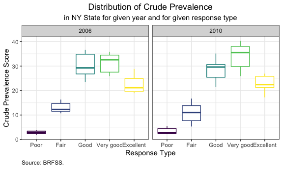

P8105: Data Science I
================
Assignment 3<br>Jimmy Kelliher (UNI: jmk2303)

-   [Problem 1](#problem-1)
    -   [The Instacart Data](#the-instacart-data)
    -   [Orders by Aisle](#orders-by-aisle)
    -   [Most Popular Items by Aisle](#most-popular-items-by-aisle)
    -   [Average Time of Day for Orders with Specific
        Products](#average-time-of-day-for-orders-with-specific-products)
-   [Problem 2](#problem-2)
    -   [The BRFSS Data](#the-brfss-data)
    -   [Representation by State](#representation-by-state)
    -   [Average Prevalence Score over Time by
        State](#average-prevalence-score-over-time-by-state)
    -   [Distribution of Prevalence Score by Year and
        Response](#distribution-of-prevalence-score-by-year-and-response)
-   [Problem 3](#problem-3)
    -   [The Accelerometer Data](#the-accelerometer-data)
    -   [Trends in Daily Activity](#trends-in-daily-activity)
    -   [Trends in Minutely Activity](#trends-in-minutely-activity)

<!------------------------------------------------------------------------------------------
Preamble
------------------------------------------------------------------------------------------->
<!------------------------------------------------------------------------------------------
Problem 1
------------------------------------------------------------------------------------------->

# Problem 1

## The Instacart Data

We begin by loading in the Instacart data and outputting the first few
observations.

``` r
# load in data
data("instacart")

# output head of data
head(instacart) %>% knitr::kable()
```

| order\_id | product\_id | add\_to\_cart\_order | reordered | user\_id | eval\_set | order\_number | order\_dow | order\_hour\_of\_day | days\_since\_prior\_order | product\_name                                 | aisle\_id | department\_id | aisle                | department   |
|----------:|------------:|---------------------:|----------:|---------:|:----------|--------------:|-----------:|---------------------:|--------------------------:|:----------------------------------------------|----------:|---------------:|:---------------------|:-------------|
|         1 |       49302 |                    1 |         1 |   112108 | train     |             4 |          4 |                   10 |                         9 | Bulgarian Yogurt                              |       120 |             16 | yogurt               | dairy eggs   |
|         1 |       11109 |                    2 |         1 |   112108 | train     |             4 |          4 |                   10 |                         9 | Organic 4% Milk Fat Whole Milk Cottage Cheese |       108 |             16 | other creams cheeses | dairy eggs   |
|         1 |       10246 |                    3 |         0 |   112108 | train     |             4 |          4 |                   10 |                         9 | Organic Celery Hearts                         |        83 |              4 | fresh vegetables     | produce      |
|         1 |       49683 |                    4 |         0 |   112108 | train     |             4 |          4 |                   10 |                         9 | Cucumber Kirby                                |        83 |              4 | fresh vegetables     | produce      |
|         1 |       43633 |                    5 |         1 |   112108 | train     |             4 |          4 |                   10 |                         9 | Lightly Smoked Sardines in Olive Oil          |        95 |             15 | canned meat seafood  | canned goods |
|         1 |       13176 |                    6 |         0 |   112108 | train     |             4 |          4 |                   10 |                         9 | Bag of Organic Bananas                        |        24 |              4 | fresh fruits         | produce      |

There are 1.38 million observations and 15 variables in the `instacart`
dataset. Each observation in the dataset is uniquely identified by the
pair (`order_id`, `product_id`), which respectively indicate each order
and each product purchased in said order. There are over 131,000 users
represented in the data, and each user purchased about 10.55 products
per order on average.

## Orders by Aisle

We begin our analysis of the dataset by assessing the popularity of each
aisle. We observe that there are 134 aisles represented in the data, and
we present the top ten most heavily shopped aisles below.

``` r
# rank aisles according to number of items ordered from each aisle
aisleRank <-
  instacart %>%
  # group by aisle
  group_by(aisle) %>%
  # count the items in each aisle
  summarize(n_items_ordered = n()) %>%
  # order the aisles from most popular to least popular
  arrange(-n_items_ordered) %>%
  # adjust case of variables for readability
  mutate(aisle = str_to_title(aisle))

# output top ten products
head(aisleRank, 10) %>% knitr::kable(
    col.names = c("Aisle", "Number of Products Ordered")
  , format.args = list(big.mark = ",")
)
```

| Aisle                         | Number of Products Ordered |
|:------------------------------|---------------------------:|
| Fresh Vegetables              |                    150,609 |
| Fresh Fruits                  |                    150,473 |
| Packaged Vegetables Fruits    |                     78,493 |
| Yogurt                        |                     55,240 |
| Packaged Cheese               |                     41,699 |
| Water Seltzer Sparkling Water |                     36,617 |
| Milk                          |                     32,644 |
| Chips Pretzels                |                     31,269 |
| Soy Lactosefree               |                     26,240 |
| Bread                         |                     23,635 |

Not surprisingly, fresh fruits and vegetables top our list, each aisle
nearly doubling the third-most trafficked aisle (which is yet another
aisle selling fruits and vegetables). Not only are these commonly
consumed items, they are also very prone to perishing, so the high
demand makes sense. We also see several aisles featuring dairy and bread
making our top ten list. Though unsurprising, this is certainly a good
sanity check on the quality of the dataset! Intuitive findings like this
help us feel confident about the underlying data. We next construct a
bar graph featuring the most popular aisles among those with over 10,000
orders.

``` r
# create vertical bar chart of aisles with highest order traffic
aisleRank %>%
  # keep aisles with more than 10000 orders
  filter(n_items_ordered > 10000) %>%
  # make aisle an ordered factor variable so that bar plot is ordered intuitively
  mutate(aisle = reorder(factor(aisle), n_items_ordered)) %>%
  # instantiate plot
  ggplot(aes(x = aisle, y = n_items_ordered / 1000)) +
  # add bars representing counts of orders
  geom_bar(stat = "identity", width = 0.75) +
  # flip axes for readability
  coord_flip() +
  # add meta-data
  labs(
      title    = "Aisles Ranked by Frequency of Orders"
    , subtitle = "for aisles with more than 10,000 orders"
    , x        = ""
    , y        = "Thousands of Orders"
    , caption  = "Source: Instacart."
  )
```


Wow! This table is so long that we had to adjust the aspect ratio to
make it readable. We again see our original top ten, along with some
other usual suspects: eggs, crackers, cereal, etc. While the table is
useful, the above bar chart really highlights the exponential decay in
popularity. We also begin to see that some of the aisle categories might
be a little arbitrary (e.g., the distinction between packaged vegetables
and fruits and packaged produce), so someone conducting a more careful
analysis might consider manually grouping some of the aisles together.

## Most Popular Items by Aisle

We next construct a table enumerating the most popular products in three
specific aisles.

``` r
# identify aisles of interest
myAisles <- c(
    "baking ingredients"
  , "dog food care"
  , "packaged vegetables fruits"
)

# construct table of top three products for each aisle in myAisles
instacart %>%
  # restrict to aisles of interest
  filter(aisle %in% myAisles) %>%
  # group by pairs (aisle, item)
  group_by(aisle, product_name) %>%
  # count number of orders for given item within given aisle
  summarize(n_items_ordered = n()) %>%
  # rank by maximum orders
  mutate(rank = min_rank(-n_items_ordered)) %>%
  # restrict to top three items in each aisle
  filter(rank <= 3) %>%
  # sort for readability
  arrange(aisle, rank) %>%
  # remove extraneous columns
  select(-rank) %>%
  # adjust case of characters for readability
  mutate(aisle = str_to_title(aisle)) %>%
  # output table
  knitr::kable(
      col.names   = c("Aisle", "Product", "Count")
    , format.args = list(big.mark = ",")
  )
```

| Aisle                      | Product                                       | Count |
|:---------------------------|:----------------------------------------------|------:|
| Baking Ingredients         | Light Brown Sugar                             |   499 |
| Baking Ingredients         | Pure Baking Soda                              |   387 |
| Baking Ingredients         | Cane Sugar                                    |   336 |
| Dog Food Care              | Snack Sticks Chicken & Rice Recipe Dog Treats |    30 |
| Dog Food Care              | Organix Chicken & Brown Rice Recipe           |    28 |
| Dog Food Care              | Small Dog Biscuits                            |    26 |
| Packaged Vegetables Fruits | Organic Baby Spinach                          | 9,784 |
| Packaged Vegetables Fruits | Organic Raspberries                           | 5,546 |
| Packaged Vegetables Fruits | Organic Blueberries                           | 4,966 |

Sugar and baking soda dominate the baking aisle, and chicken-based food
dominates the dog food aisle. Of course, both of these aisles offer
products that can last quite some time, so purchase volume is relatively
low. Conversely, the packaged fruits and vegetables aisles sees quite a
bit more traffic (as we learned above). I buy spinach, raspberries, and
blueberries every week, so it’s nice to see my contributions manifest in
the world of data!

## Average Time of Day for Orders with Specific Products

Finally, we construct a table illustrating the average time two
particular items are purchased each day of the week. Based on a
histogram of the data (which we omit for brevity), we assume that
`order_dow = 0` corresponds to Sunday, the universal day of grocery
shopping.

``` r
# identify items of interest
myItems <- c(
    "Pink Lady Apples"
  , "Coffee Ice Cream"
)

# construct a vector of days of the week to correspond to the integer values of order_dow
myDays  <- c("Sunday", "Monday", "Tuesday", "Wednesday", "Thursday", "Friday", "Saturday")

# construct a table of average volume for each item in myItems and for each day of the week
instacart %>%
  # restrict to items of interest
  filter(product_name %in% myItems) %>%
  # map the integer-valued days of the week (e.g., 0) to characters (e.g., "Sunday")
  mutate(order_dow_char = 
    sapply(
        order_dow                              # order_dow = 0 denotes Sunday, etc.
      , function(x) myDays[as.integer(x + 1)]) # myDays[1]     denotes Sunday, etc.
  ) %>%
  # include original order_dow in grouping for sorting purposes
  group_by(product_name, order_dow, order_dow_char) %>%
  # compute average number of orders for each item on each day of the week
  summarize(mean_hour_of_day = mean(order_hour_of_day)) %>%
  # regroup now that the days of the week are properly sorted
  group_by(product_name, order_dow_char) %>%  
  # drop order_dow now that the days of the week are properly sorted
  select(-order_dow) %>%
  # pivot to a more human-friendly table
  pivot_wider(
      names_from  = order_dow_char
    , values_from = mean_hour_of_day
  ) %>%
  # rename columns for readability
  rename(Product = product_name) %>%
  # output table
  knitr::kable(
      col.names = c("Product", myDays)
    , digits    = 2
  )
```

| Product          | Sunday | Monday | Tuesday | Wednesday | Thursday | Friday | Saturday |
|:-----------------|-------:|-------:|--------:|----------:|---------:|-------:|---------:|
| Coffee Ice Cream |  13.77 |  14.32 |   15.38 |     15.32 |    15.22 |  12.26 |    13.83 |
| Pink Lady Apples |  13.44 |  11.36 |   11.70 |     14.25 |    11.55 |  12.78 |    11.94 |

On a majority of days of the week, people tend to buy Pink Lady apples
before noon. Conversely, customers tend to purchase coffee ice cream
later in the afternoon, perhaps because we are more likely to succumb to
our sweet tooth once the sun goes down! Or rather, a more likely (and
less fun) story is that shoppers might be worried about the quality of
leftover produce by the end of the day. For both products, people tend
to order them later in the day on Wednesday, but no one wants an apple
after tooth-hurty - I mean, 2:30 PM.

<!------------------------------------------------------------------------------------------
Problem 2
------------------------------------------------------------------------------------------->

# Problem 2

## The BRFSS Data

Next, we load in data from the Behavioral Risk Factors Surveillance
System (BRFSS) and output the first few observations.

``` r
# load in data
data("brfss_smart2010")

# output head of data
head(brfss_smart2010) %>% knitr::kable()
```

| Year | Locationabbr | Locationdesc          | Class         | Topic               | Question                                                             | Response              | Sample\_Size | Data\_value | Confidence\_limit\_Low | Confidence\_limit\_High | Display\_order | Data\_value\_unit | Data\_value\_type | Data\_Value\_Footnote\_Symbol | Data\_Value\_Footnote | DataSource | ClassId | TopicId | LocationID | QuestionID | RESPID  | GeoLocation             |
|-----:|:-------------|:----------------------|:--------------|:--------------------|:---------------------------------------------------------------------|:----------------------|-------------:|------------:|-----------------------:|------------------------:|---------------:|:------------------|:------------------|:------------------------------|:----------------------|:-----------|:--------|:--------|:-----------|:-----------|:--------|:------------------------|
| 2010 | AL           | AL - Jefferson County | Health Status | Overall Health      | How is your general health?                                          | Excellent             |           94 |        18.9 |                   14.1 |                    23.6 |              1 | %                 | Crude Prevalence  | NA                            | NA                    | BRFSS      | CLASS08 | Topic41 | NA         | GENHLTH    | RESP056 | (33.518601, -86.814688) |
| 2010 | AL           | AL - Jefferson County | Health Status | Overall Health      | How is your general health?                                          | Very good             |          148 |        30.0 |                   24.9 |                    35.0 |              2 | %                 | Crude Prevalence  | NA                            | NA                    | BRFSS      | CLASS08 | Topic41 | NA         | GENHLTH    | RESP057 | (33.518601, -86.814688) |
| 2010 | AL           | AL - Jefferson County | Health Status | Overall Health      | How is your general health?                                          | Good                  |          208 |        33.1 |                   28.2 |                    38.0 |              3 | %                 | Crude Prevalence  | NA                            | NA                    | BRFSS      | CLASS08 | Topic41 | NA         | GENHLTH    | RESP058 | (33.518601, -86.814688) |
| 2010 | AL           | AL - Jefferson County | Health Status | Overall Health      | How is your general health?                                          | Fair                  |          107 |        12.5 |                    9.5 |                    15.4 |              4 | %                 | Crude Prevalence  | NA                            | NA                    | BRFSS      | CLASS08 | Topic41 | NA         | GENHLTH    | RESP059 | (33.518601, -86.814688) |
| 2010 | AL           | AL - Jefferson County | Health Status | Overall Health      | How is your general health?                                          | Poor                  |           45 |         5.5 |                    3.5 |                     7.4 |              5 | %                 | Crude Prevalence  | NA                            | NA                    | BRFSS      | CLASS08 | Topic41 | NA         | GENHLTH    | RESP060 | (33.518601, -86.814688) |
| 2010 | AL           | AL - Jefferson County | Health Status | Fair or Poor Health | Health Status (variable calculated from one or more BRFSS questions) | Good or Better Health |          450 |        82.0 |                   78.6 |                    85.3 |              6 | %                 | Crude Prevalence  | NA                            | NA                    | BRFSS      | CLASS08 | Topic24 | NA         | \_RFHLTH   | RESP061 | (33.518601, -86.814688) |

For our purposes, we will filter the data by topic and response type
before we begin our analysis.

``` r
# identify topics of interest
myTopics    <- c("Overall Health")

# identify responses of interest, which will also determine order of factor levels
myResponses <- c("Poor", "Fair", "Good", "Very good", "Excellent")

# construct filtered and clean dataset
brfssOH <-
  brfss_smart2010 %>%
  # clean up variable names
  janitor::clean_names() %>%
  # retain only observations with topic in myTopics and response in myResponses
  filter(
      topic    %in% myTopics
    , response %in% myResponses
  ) %>%
  # reclassify response as an ordered factor variable per the order of myResponses
  mutate(response = factor(response, levels = myResponses))

# output head of data
head(brfssOH) %>% knitr::kable()
```

| year | locationabbr | locationdesc          | class         | topic          | question                    | response  | sample\_size | data\_value | confidence\_limit\_low | confidence\_limit\_high | display\_order | data\_value\_unit | data\_value\_type | data\_value\_footnote\_symbol | data\_value\_footnote | data\_source | class\_id | topic\_id | location\_id | question\_id | respid  | geo\_location           |
|-----:|:-------------|:----------------------|:--------------|:---------------|:----------------------------|:----------|-------------:|------------:|-----------------------:|------------------------:|---------------:|:------------------|:------------------|:------------------------------|:----------------------|:-------------|:----------|:----------|:-------------|:-------------|:--------|:------------------------|
| 2010 | AL           | AL - Jefferson County | Health Status | Overall Health | How is your general health? | Excellent |           94 |        18.9 |                   14.1 |                    23.6 |              1 | %                 | Crude Prevalence  | NA                            | NA                    | BRFSS        | CLASS08   | Topic41   | NA           | GENHLTH      | RESP056 | (33.518601, -86.814688) |
| 2010 | AL           | AL - Jefferson County | Health Status | Overall Health | How is your general health? | Very good |          148 |        30.0 |                   24.9 |                    35.0 |              2 | %                 | Crude Prevalence  | NA                            | NA                    | BRFSS        | CLASS08   | Topic41   | NA           | GENHLTH      | RESP057 | (33.518601, -86.814688) |
| 2010 | AL           | AL - Jefferson County | Health Status | Overall Health | How is your general health? | Good      |          208 |        33.1 |                   28.2 |                    38.0 |              3 | %                 | Crude Prevalence  | NA                            | NA                    | BRFSS        | CLASS08   | Topic41   | NA           | GENHLTH      | RESP058 | (33.518601, -86.814688) |
| 2010 | AL           | AL - Jefferson County | Health Status | Overall Health | How is your general health? | Fair      |          107 |        12.5 |                    9.5 |                    15.4 |              4 | %                 | Crude Prevalence  | NA                            | NA                    | BRFSS        | CLASS08   | Topic41   | NA           | GENHLTH      | RESP059 | (33.518601, -86.814688) |
| 2010 | AL           | AL - Jefferson County | Health Status | Overall Health | How is your general health? | Poor      |           45 |         5.5 |                    3.5 |                     7.4 |              5 | %                 | Crude Prevalence  | NA                            | NA                    | BRFSS        | CLASS08   | Topic41   | NA           | GENHLTH      | RESP060 | (33.518601, -86.814688) |
| 2010 | AL           | AL - Mobile County    | Health Status | Overall Health | How is your general health? | Excellent |           91 |        15.6 |                   11.0 |                    20.1 |              1 | %                 | Crude Prevalence  | NA                            | NA                    | BRFSS        | CLASS08   | Topic41   | NA           | GENHLTH      | RESP056 | (30.683993, -88.170637) |

There are 10625 observations and 23 variables in the filtered `brfss`
dataset, which includes only observations pertaining to the topic of
overall health and for which a response in {“Poor”, “Fair”, “Good”,
“Very good”, “Excellent”} was recorded. Each row in the dataset is
uniquely identified by the triple (`year`, `locationdesc`, `response`),
such that each observation corresponds to a sample of respondents in a
given year and locality for each of the five responses mentioned above.
The dataset contains samples from 2002 to 2010 across 404 different
localities. The variable of interest in the data is `data_value`, which
is just a crude prevalence measure of overall health.

## Representation by State

We begin our analysis by identifying which states were observed at seven
or more locations in 2002 and 2010. To accomplish this, we will
construct a function that takes a year `myYear` and a threshold of
unique localities `myLoc` and outputs the states that were observed at
`myLoc` or more locations during `myYear`.

``` r
# construct a function that identifies states observed in at least myLoc locations in myYear
statesObserved <- function(
    myYear = 2002 # the year of interest; defaults to 2002
  , myLoc  = 7    # the location threshold; defaults to 7
) {
  # identify the list of states observed in at least myLoc locations during myYear 
  myStates <-
    brfssOH %>%
    # restrict to myYear
    filter(year %in% myYear) %>%
    # retain only dataset of locations by state
    select(locationabbr, locationdesc) %>%
    # remove duplicates
    distinct() %>%
    # group by state
    group_by(locationabbr) %>%
    # count number of locations in each state
    summarize(count = n()) %>%
    # retain only states for which count of locations is not less than myLoc
    filter(count >= myLoc) %>%
    # pull vector of such states
    pull(locationabbr)

  # output result as a meaningful sentence
  paste(c(
      "the following "
    # identify number of states meeting criterion
    , paste(length(myStates), "states were observed at 7 or more locations in ")
    # identify year
    , paste(myYear, ": ", sep = "")
    # enumerate states meeting criterion
    , paste(myStates, collapse = ", ")
  ), collapse = "")
}
```

With our function in tow, we can easily identify states meeting our
criterion with a simple in-line R command. In particular, the following
6 states were observed at 7 or more locations in 2002: CT, FL, MA, NC,
NJ, PA; and the following 14 states were observed at 7 or more locations
in 2010: CA, CO, FL, MA, MD, NC, NE, NJ, NY, OH, PA, SC, TX, WA. As time
went on, representation of state localities in the survey data seemed to
improve dramatically.

## Average Prevalence Score over Time by State

We next further restrict our data to responses recorded as “Excellent”,
and we aggregate `data_value` via taking averages for each locality in
each year.

``` r
# construct a spaghetti chart of average data_value over time by state
brfssOH %>%
  # restrict to excellent response
  filter(response == "Excellent") %>%
  # group by year and state
  group_by(year, locationabbr) %>%
  # compute average crude prevalence score
  summarize(mean_value = mean(data_value, na.rm = TRUE)) %>%
  # instantiate plot
  ggplot(aes(x = year, y = mean_value)) +
  # add lines for time series trends
  geom_line(aes(group = locationabbr, color = locationabbr), alpha = 0.5, size = 0.5) +
  geom_smooth(se = FALSE, col = "black") + 
  theme(legend.position = "none") +
  # add meta-data
  labs(
      title    = "Crude Prevalence over Time"
    , subtitle = "for each state"
    , x        = "Year"
    , y        = "Average Crude Prevalence Score"
    , caption  = "Source: BRFSS."
  )
```


Spaghetti charts make it difficult to discern trends for individual
states, but they do help us get a sense of the heterogeneity in the data
over time. In particular, with the average trend overlaid, we observe a
very slight decline in score from 2002 to 2006, and a flat trend in
score thereafter. The spread of the data is also fairly consistent over
time, with three notable outliers (on the lower extreme) in 2005, 2007,
and 2009. Otherwise, average scores for states almost always seem to
fall between 17 and 27.

## Distribution of Prevalence Score by Year and Response

Finally, we construct two visualizations of the distribution of
`data_value` for the state of NY for the years 2006 and 2010, stratified
by response type. We originally did not stratify by response type, which
led to a particularly uninformative chart. As such, we omit this
iteration and instead show two more useful characterizations of the
underlying distribution.

``` r
# construct a box plot of prevalence scores by year and response type
brfssOH %>%
  # restrict to NY state and years of interest
  filter(locationabbr == "NY", year %in% c(2006, 2010)) %>%
  # group by year
  group_by(year) %>%
  # instantiate plot
  ggplot(aes(x = response, y = data_value, color = response)) +
  # add box plot
  geom_boxplot() +
  # stratify by year
  facet_grid(~year) + 
  # omit legend
  theme(legend.position = "none") +
  # add meta-data
  labs(
      title    = "Distribution of Crude Prevalence"
    , subtitle = "in NY State for given year and for given response type"
    , x        = "Response Type"
    , y        = "Crude Prevalence Score"
    , caption  = "Source: BRFSS."
  )
```



In the above series of box plots, we see one striking result: prevalence
score is positively correlated with response type - *up to a certain
point*. In both years, respondents who reported that their overall
health was “Excellent” tended to have far lower prevalence scores than
those reporting “Good” or “Very good” overall health. This serves as yet
another cautionary tale as to the limits of self-reported data;
especially when it comes to health, confidence can often be unfounded.
In both years, the distribution of scores among those reporting “Poor”
overall health exhibits very little variation, so the other extreme of
self-reporting bias does not seem to hold here. Comparing year to year,
those reporting “Very good” health in 2010 outperformed their peers in
2006, but the distributions seem otherwise stable.

``` r
# construct a box plot of prevalence scores by year and response type
brfssOH %>%
  # restrict to NY state and years of interest
  filter(locationabbr == "NY", year %in% c(2006, 2010)) %>%
  # group by year
  group_by(year) %>%
  # instantiate plot
  ggplot(aes(x = data_value, group = response, color = response)) +
  # add density plot
  geom_density() +
  # stratify by year
  facet_grid(~year) +
  # add meta-data
  labs(
      title    = "Distribution of Crude Prevalence"
    , subtitle = "in NY State for given year and for given response type"
    , x        = "Crude Prevalence Score"
    , y        = "Density"
    , caption  = "Source: BRFSS."
    , color    = "Response Type: "
  )
```


For completion, we also present density plots of the distribution of
prevalence scores by state and year. Here, it is a little easier to see
any temporal changes between 2006 and 2010, particularly for the “Poor”
health respondents. We can also see that the distributions become less
skewed over time, which could be a function of improvements in sampling
size or survey response.

<!------------------------------------------------------------------------------------------
Problem 3
------------------------------------------------------------------------------------------->

# Problem 3

## The Accelerometer Data

We pull in our third and final dataset, courtesy of our very own CUMC!

``` r
# read in data
accelDataRaw <- read_csv("datasets/accel_data.csv")
```

Oh my! We are not even going to knit this raw dataset to a table, as it
is formatted as a rectangular table of days by minute at a *minutely*
frequency, and as such has over 1,440 columns (for each minute in a
day). This won’t do! Let’s tidy up our data and hope that CUMC does
better going forward.

``` r
# tidy up this mess of a dataset
accelData <-
  accelDataRaw %>%
  # pivot longer, creating a column of minutes and a column of activity readings
  pivot_longer(
      cols            = starts_with("activity.")
    , names_to        = "minute_of_day"
    , names_prefix    = "activity."
    , names_transform = list(minute_of_day = as.integer)
    , values_to       = "activity"
  ) %>%
  # rename day variable to make it clear that it is a character vector
  rename(day_of_week_char = day) %>%
  # reclassify variables sensibly
  mutate(
      week             = as.integer(week)
    # create a new id since day_id is not ordered meaningfully
    , day_of_week      = sapply(
        # we assume the data collection began on a Monday, but it is ambiguous
          day_of_week_char
        # map "Monday" to 1, "Tuesday" to 2, etc.
        , function(x) which(myDays[c(2:7, 1)] == x))
    # create an indicator that returns 1 if day_of_week_char is a weekday
    , is_weekday       = !(day_of_week_char %in% c("Saturday", "Sunday"))
    # reclassify day_of_week_char as an ordered factor class
    , day_of_week_char = factor(day_of_week_char, levels = myDays[c(2:7, 1)])
  ) %>%
  # reorder columns according to unique identifiers (week, day_of_week, minute_of_day)
  relocate(week, day_of_week, minute_of_day, day_of_week_char, is_weekday) %>%
  # sort rows according to unique identifiers
  arrange(week, day_of_week, minute_of_day) %>%
  # remove meaningless day_id
  select(-day_id)

# output head of data
head(accelData) %>% knitr::kable()
```

| week | day\_of\_week | minute\_of\_day | day\_of\_week\_char | is\_weekday | activity |
|-----:|--------------:|----------------:|:--------------------|:------------|---------:|
|    1 |             1 |               1 | Monday              | TRUE        |        1 |
|    1 |             1 |               2 | Monday              | TRUE        |        1 |
|    1 |             1 |               3 | Monday              | TRUE        |        1 |
|    1 |             1 |               4 | Monday              | TRUE        |        1 |
|    1 |             1 |               5 | Monday              | TRUE        |        1 |
|    1 |             1 |               6 | Monday              | TRUE        |        1 |

Even though the instructions ask us to retain all of the original
variables of the dataset, it does not make sense to retain `day_id`
since the days of the week are not even properly ordered in the original
spreadsheet! The first row is labeled as “Friday,” the second row is
labeled as “Monday,” and the third row is labeled as “Saturday.” As
such, we cannot even be certain if the study began on a Friday or some
other day, which will be important when we consider the time trend in a
future exercise. This is less a tidiness issue and more a data quality
issue. Alas! To deal with this frustration, we assume that data
collection began on a Monday, and we order our dataset accordingly to
generate a proper ID variable. In particular, the ordered triple
(`week`, `day_of_week`, `minute_of_day`) uniquely identifies each row,
and it tries to impart an ordering as best it can given the
aforementioned data ambiguity. Thus, (`week`, `day_of_week`,
`minute_of_day`) = (1, 1, 1) corresponds to (our best guess at) the
first observation chronologically in the dataset. Of course, this
ordering is no worse than the original ordering in the untidy dataset.

In any event, we proceed. There are 50400 observations and 6 variables
in the tidied `accelData` dataset. As alleged earlier, each row in the
dataset is uniquely identified by the triple (`week`, `day_of_week`,
`minute_of_day`), such that each observation corresponds to every minute
that our test subject was recorded over the 35-day period. The variable
of interest is `activity`, which quantifies the recordings of the
accelerometer, and hence serves as an index for physical activity. While
the mean reading in a given minute was 267.04, the standard deviation of
accelerometer readings was 443.16, so the variation in the data is
substantial. This makes sense, though, as the subject was recorded even
in his sleep.

## Trends in Daily Activity

As we move to our analysis, we first consider the total activity each
day.

``` r
# construct a table of total activity each day
accelData %>%
  # group by week day_of_week, and day_of_week_char, toward making a readable table
  group_by(week, day_of_week, day_of_week_char) %>%
  # compute total activity
  summarize(total_activity = sum(activity)) %>%
  # group by week and day_of_week_char, toward removing day_of_week
  group_by(week, day_of_week_char) %>%
  # remove day_of_week, now that we no longer need it for sorting purposes
  select(-day_of_week) %>%
  # output table with values rounded to nearest integer
  knitr::kable(
      col.names = c("Week Number", "Day", "Total Activity")
    , d = 0
  )
```

| Week Number | Day       | Total Activity |
|------------:|:----------|---------------:|
|           1 | Monday    |          78828 |
|           1 | Tuesday   |         307094 |
|           1 | Wednesday |         340115 |
|           1 | Thursday  |         355924 |
|           1 | Friday    |         480543 |
|           1 | Saturday  |         376254 |
|           1 | Sunday    |         631105 |
|           2 | Monday    |         295431 |
|           2 | Tuesday   |         423245 |
|           2 | Wednesday |         440962 |
|           2 | Thursday  |         474048 |
|           2 | Friday    |         568839 |
|           2 | Saturday  |         607175 |
|           2 | Sunday    |         422018 |
|           3 | Monday    |         685910 |
|           3 | Tuesday   |         381507 |
|           3 | Wednesday |         468869 |
|           3 | Thursday  |         371230 |
|           3 | Friday    |         467420 |
|           3 | Saturday  |         382928 |
|           3 | Sunday    |         467052 |
|           4 | Monday    |         409450 |
|           4 | Tuesday   |         319568 |
|           4 | Wednesday |         434460 |
|           4 | Thursday  |         340291 |
|           4 | Friday    |         154049 |
|           4 | Saturday  |           1440 |
|           4 | Sunday    |         260617 |
|           5 | Monday    |         389080 |
|           5 | Tuesday   |         367824 |
|           5 | Wednesday |         445366 |
|           5 | Thursday  |         549658 |
|           5 | Friday    |         620860 |
|           5 | Saturday  |           1440 |
|           5 | Sunday    |         138421 |

This table is difficult to read, but we do notice that during the Friday
and Saturday of Week 5 and during the Saturday and Sunday of Week 6,
total activity reads as an outlier. In particular, during the last two
Saturdays of the study, the subject was recorded as having an activity
of 1,440. Because the accelerometer never records below one in a given
minute, and because there are 1,440 minutes in a day, this is the
minimum potential reading we could observe. Given this absurdity, it is
safe to conclude that the subject forgot to wear - or intentionally
removed - the accelerometer during some fun weekend revelry. If we want
to actually consider time trends, however, we must construct a chart of
the data, as it is too difficult to ascertain anything about the trend
with a table.

``` r
# construct a chart of total activity each day
accelData %>%
  # group by week and day_of_week
  group_by(week, day_of_week) %>%
  # compute total activity, in thousands
  summarize(total_activity = sum(activity) / 1000) %>%
  # instantiate plot
  ggplot(aes(x = week + (day_of_week - 1) / 7, y = total_activity)) +
  # add trend line
  geom_line() +
  # add meta-data
  labs(
      title    = "Trend in Total Activity"
    , subtitle = "in thousands, by day"
    , x        = "Week"
    , y        = "Total Daily Activity (in Thousands)"
    , caption  = "Source: CUMC."
  )
```


While the above trend helps us identify the outliers very quickly, and
while it is less cumbersome than a table, it does not actually offer too
much insight. There is no obvious weekly seasonality in the data,
possibly due to inconsistent weekend usage of the accelerometer. We do
see a gradual increase of activity until the peak on Monday of Week 3,
followed by a steady decline for the following two weeks. Again, it is
hard to discern whether this due to a change in motivation or a change
in consistency in using the device.

## Trends in Minutely Activity

Finally, we construct a chart of average minutely activity, stratified
by day of the week. We will overlay smoothed day-of-week trends on top
of the (rather noisy) average minutely activity values.

``` r
# create a spaghetti chart of average minutely activity
accelData %>%
  # group by day and minute
  group_by(day_of_week, day_of_week_char, minute_of_day) %>%
  # compute the average minute activity across weeks for each day
  summarise(mean_activity = mean(activity)) %>%
  # instantiate plot
  ggplot(aes(
      x     = (minute_of_day - 1) / 60     # convert to hours
    , y     = mean_activity
    , color = day_of_week_char
  )) +
  # add trend lines
  geom_line(alpha = 0.25, size = 0.5) +
  # add smoothed trend lines
  geom_smooth(se = FALSE) +
  # position legend on the right
  theme(legend.position = "right") +
  # add meta-data
  labs(
      title    = "Trend in Minutely Activity"
    , subtitle = "across all 35 days"
    , x        = "Hour of Day"
    , y        = "Average Activity Index"
    , caption  = "Source: CUMC."
    , color    = "Day of the Week"
  )
```


This is much more interesting than the previous trend! In particular, we
observe a lot of consistency across days of the week from the hours of
midnight to about 6:00 PM, save the early hours of Sunday when the
subject seems to be much more active. At night, however, we see a lot
more heterogeneity, with Friday night serving as the clear peak in
average activity for the subject. We must be careful, however, as it
would appear that Saturday seems to be the least active day for the
subject across the board, but this is probably due to the two outliers
we observed earlier. If the subject did indeed neglect to use the
accelerometer properly on the weekend, the trend for Saturday would be
systematically biased downward, and hence the chart above would be
misleading.
