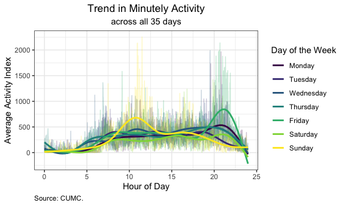

P8105: Data Science I
================
Assignment 3<br>Jimmy Kelliher (UNI: jmk2303)

-   [Problem 1](#problem-1)
    -   [Instacart](#instacart)
-   [Problem 2](#problem-2)
    -   [Behavioral Risk Factors Surveillance System
        (BRFSS)](#behavioral-risk-factors-surveillance-system-brfss)
-   [Problem 3](#problem-3)
    -   [Accelerometer Data](#accelerometer-data)

<!------------------------------------------------------------------------------------------
Preamble
------------------------------------------------------------------------------------------->
<!------------------------------------------------------------------------------------------
Problem 1
------------------------------------------------------------------------------------------->

# Problem 1

## Instacart

We begin by loading in the Instacart data and outputting the first few
observations.

``` r
data("instacart")
head(instacart) %>% knitr::kable()
```

| order\_id | product\_id | add\_to\_cart\_order | reordered | user\_id | eval\_set | order\_number | order\_dow | order\_hour\_of\_day | days\_since\_prior\_order | product\_name                                 | aisle\_id | department\_id | aisle                | department   |
|----------:|------------:|---------------------:|----------:|---------:|:----------|--------------:|-----------:|---------------------:|--------------------------:|:----------------------------------------------|----------:|---------------:|:---------------------|:-------------|
|         1 |       49302 |                    1 |         1 |   112108 | train     |             4 |          4 |                   10 |                         9 | Bulgarian Yogurt                              |       120 |             16 | yogurt               | dairy eggs   |
|         1 |       11109 |                    2 |         1 |   112108 | train     |             4 |          4 |                   10 |                         9 | Organic 4% Milk Fat Whole Milk Cottage Cheese |       108 |             16 | other creams cheeses | dairy eggs   |
|         1 |       10246 |                    3 |         0 |   112108 | train     |             4 |          4 |                   10 |                         9 | Organic Celery Hearts                         |        83 |              4 | fresh vegetables     | produce      |
|         1 |       49683 |                    4 |         0 |   112108 | train     |             4 |          4 |                   10 |                         9 | Cucumber Kirby                                |        83 |              4 | fresh vegetables     | produce      |
|         1 |       43633 |                    5 |         1 |   112108 | train     |             4 |          4 |                   10 |                         9 | Lightly Smoked Sardines in Olive Oil          |        95 |             15 | canned meat seafood  | canned goods |
|         1 |       13176 |                    6 |         0 |   112108 | train     |             4 |          4 |                   10 |                         9 | Bag of Organic Bananas                        |        24 |              4 | fresh fruits         | produce      |

There are 1.38 million observations and 15 variables in the `instacart`
dataset. Each observation in the dataset is uniquely identified by the
pair (`order_id`, `product_id`), which respectively indicate each order
and each product purchased in said order. There are over 131,000 users
represented in the data, and each user purchased about 10.55 products
per order on average. There are 134 aisles represented in the data, and
we present the top ten most heavily shopped aisles below.

``` r
# rank aisles according to number of items ordered from each aisle
aisleRank <-
  instacart %>%
  # group by aisle
  group_by(aisle) %>%
  # count the items in each aisle
  summarize(n_items_ordered = n()) %>%
  # order the aisles from most popular to least popular
  arrange(-n_items_ordered) %>%
  # adjust case of variables for readability
  mutate(aisle = str_to_title(aisle))

# output top ten products
head(aisleRank, 10) %>% knitr::kable(
    col.names = c("Aisle", "Number of Products Ordered")
  , format.args = list(big.mark = ",")
)
```

| Aisle                         | Number of Products Ordered |
|:------------------------------|---------------------------:|
| Fresh Vegetables              |                    150,609 |
| Fresh Fruits                  |                    150,473 |
| Packaged Vegetables Fruits    |                     78,493 |
| Yogurt                        |                     55,240 |
| Packaged Cheese               |                     41,699 |
| Water Seltzer Sparkling Water |                     36,617 |
| Milk                          |                     32,644 |
| Chips Pretzels                |                     31,269 |
| Soy Lactosefree               |                     26,240 |
| Bread                         |                     23,635 |

Make a plot that shows the number of items ordered in each aisle,
limiting this to aisles with more than 10000 items ordered. Arrange
aisles sensibly, and organize your plot so others can read it.

``` r
# create vertical bar chart of aisles with highest order traffic
aisleRank %>%
  # keep aisles with more than 10000 orders
  filter(n_items_ordered > 10000) %>%
  # make aisle an ordered factor variable so that bar plot is ordered intuitively
  mutate(aisle = reorder(factor(aisle), n_items_ordered)) %>%
  # instantiate plot
  ggplot(aes(x = aisle, y = n_items_ordered / 1000)) +
  # add bars representing counts of orders
  geom_bar(stat = "identity", width = 0.75) +
  # flip axes for readability
  coord_flip() +
  # add meta-data
  labs(
      title    = "Aisles Ranked by Frequency of Orders"
    , subtitle = "for aisles with more than 10,000 orders"
    , x        = ""
    , y        = "Thousands of Orders"
    , caption  = "Source: Instacart.")
```


Make a table showing the three most popular items in each of the aisles
“baking ingredients”, “dog food care”, and “packaged vegetables fruits”.
Include the number of times each item is ordered in your table.

``` r
# identify aisles of interest
myAisles <- c(
    "baking ingredients"
  , "dog food care"
  , "packaged vegetables fruits"
)

instacart %>%
  # restrict to aisles of interest
  filter(aisle %in% myAisles) %>%
  # group by pairs (aisle, item)
  group_by(aisle, product_name) %>%
  # count number of orders for given item within given aisle
  summarize(n_items_ordered = n()) %>%
  # rank by maximum orders
  mutate(rank = min_rank(-n_items_ordered)) %>%
  # retain to three items in each aisle
  filter(rank <= 3) %>%
  # sort for readability
  arrange(aisle, rank) %>%
  # adjust case of characters for readability
  mutate(aisle = str_to_title(aisle)) %>%
  # rename columns for readability
  rename(
      Aisle = aisle
    , Product = product_name
    , Count   = n_items_ordered
  ) %>%
  # remove extraneous columns
  select(-rank) %>%
  # output table
  knitr::kable()
```

    ## `summarise()` has grouped output by 'aisle'. You can override using the `.groups` argument.

| Aisle                      | Product                                       | Count |
|:---------------------------|:----------------------------------------------|------:|
| Baking Ingredients         | Light Brown Sugar                             |   499 |
| Baking Ingredients         | Pure Baking Soda                              |   387 |
| Baking Ingredients         | Cane Sugar                                    |   336 |
| Dog Food Care              | Snack Sticks Chicken & Rice Recipe Dog Treats |    30 |
| Dog Food Care              | Organix Chicken & Brown Rice Recipe           |    28 |
| Dog Food Care              | Small Dog Biscuits                            |    26 |
| Packaged Vegetables Fruits | Organic Baby Spinach                          |  9784 |
| Packaged Vegetables Fruits | Organic Raspberries                           |  5546 |
| Packaged Vegetables Fruits | Organic Blueberries                           |  4966 |

Make a table showing the mean hour of the day at which Pink Lady Apples
and Coffee Ice Cream are ordered on each day of the week; format this
table for human readers (i.e. produce a 2 x 7 table).

``` r
# identify items of interest
myItems <- c(
    "Pink Lady Apples"
  , "Coffee Ice Cream"
)

# construct a vector of days of the week to correspond to the integer values of order_dow
myDays  <- c("Sunday", "Monday", "Tuesday", "Wednesday", "Thursday", "Friday", "Saturday")

instacart %>%
  # restrict to items of interest
  filter(product_name %in% myItems) %>%
  # map the integer-valued days of the week (e.g., 0) to characters (e.g., "Sunday")
  mutate(order_dow_char = 
    sapply(
        order_dow
      , function(x) myDays[as.integer(x + 1)]) # we assume Sunday corresponds to 0       
  ) %>%
  # include original order_dow in grouping for sorting purposes
  group_by(product_name, order_dow, order_dow_char) %>%
  # compute average number of orders for each item on each day of the week
  summarize(mean_hour_of_day = round(mean(order_hour_of_day), 2)) %>%
  # drop order_dow now that the days of the week are properly sorted
  group_by(product_name, order_dow_char) %>%  
  select(-order_dow) %>%
  # pivot to a more human-friendly table
  pivot_wider(
      names_from  = order_dow_char
    , values_from = mean_hour_of_day
  ) %>%
  # rename columns for readability
  rename(Product = product_name) %>%
  # output table
  knitr::kable()
```

    ## `summarise()` has grouped output by 'product_name', 'order_dow'. You can override using the `.groups` argument.

| Product          | Sunday | Monday | Tuesday | Wednesday | Thursday | Friday | Saturday |
|:-----------------|-------:|-------:|--------:|----------:|---------:|-------:|---------:|
| Coffee Ice Cream |  13.77 |  14.32 |   15.38 |     15.32 |    15.22 |  12.26 |    13.83 |
| Pink Lady Apples |  13.44 |  11.36 |   11.70 |     14.25 |    11.55 |  12.78 |    11.94 |

<!------------------------------------------------------------------------------------------
Problem 2
------------------------------------------------------------------------------------------->

# Problem 2

## Behavioral Risk Factors Surveillance System (BRFSS)

``` r
data("brfss_smart2010")
```

First, we filter and clean the data.

``` r
# identify topics of interest
myTopics    <- c("Overall Health")

# identify responses of interest, which will also determine order of factor levels
myResponses <- c("Poor", "Fair", "Good", "Very good", "Excellent")

brfssOH <-
  brfss_smart2010 %>%
  janitor::clean_names() %>%
  filter(
      topic    %in% myTopics
    , response %in% myResponses
  ) %>%
  mutate(response = factor(response, levels = myResponses))

head(brfssOH, 10) %>% knitr::kable()
```

| year | locationabbr | locationdesc          | class         | topic          | question                    | response  | sample\_size | data\_value | confidence\_limit\_low | confidence\_limit\_high | display\_order | data\_value\_unit | data\_value\_type | data\_value\_footnote\_symbol | data\_value\_footnote | data\_source | class\_id | topic\_id | location\_id | question\_id | respid  | geo\_location           |
|-----:|:-------------|:----------------------|:--------------|:---------------|:----------------------------|:----------|-------------:|------------:|-----------------------:|------------------------:|---------------:|:------------------|:------------------|:------------------------------|:----------------------|:-------------|:----------|:----------|:-------------|:-------------|:--------|:------------------------|
| 2010 | AL           | AL - Jefferson County | Health Status | Overall Health | How is your general health? | Excellent |           94 |        18.9 |                   14.1 |                    23.6 |              1 | %                 | Crude Prevalence  | NA                            | NA                    | BRFSS        | CLASS08   | Topic41   | NA           | GENHLTH      | RESP056 | (33.518601, -86.814688) |
| 2010 | AL           | AL - Jefferson County | Health Status | Overall Health | How is your general health? | Very good |          148 |        30.0 |                   24.9 |                    35.0 |              2 | %                 | Crude Prevalence  | NA                            | NA                    | BRFSS        | CLASS08   | Topic41   | NA           | GENHLTH      | RESP057 | (33.518601, -86.814688) |
| 2010 | AL           | AL - Jefferson County | Health Status | Overall Health | How is your general health? | Good      |          208 |        33.1 |                   28.2 |                    38.0 |              3 | %                 | Crude Prevalence  | NA                            | NA                    | BRFSS        | CLASS08   | Topic41   | NA           | GENHLTH      | RESP058 | (33.518601, -86.814688) |
| 2010 | AL           | AL - Jefferson County | Health Status | Overall Health | How is your general health? | Fair      |          107 |        12.5 |                    9.5 |                    15.4 |              4 | %                 | Crude Prevalence  | NA                            | NA                    | BRFSS        | CLASS08   | Topic41   | NA           | GENHLTH      | RESP059 | (33.518601, -86.814688) |
| 2010 | AL           | AL - Jefferson County | Health Status | Overall Health | How is your general health? | Poor      |           45 |         5.5 |                    3.5 |                     7.4 |              5 | %                 | Crude Prevalence  | NA                            | NA                    | BRFSS        | CLASS08   | Topic41   | NA           | GENHLTH      | RESP060 | (33.518601, -86.814688) |
| 2010 | AL           | AL - Mobile County    | Health Status | Overall Health | How is your general health? | Excellent |           91 |        15.6 |                   11.0 |                    20.1 |              1 | %                 | Crude Prevalence  | NA                            | NA                    | BRFSS        | CLASS08   | Topic41   | NA           | GENHLTH      | RESP056 | (30.683993, -88.170637) |
| 2010 | AL           | AL - Mobile County    | Health Status | Overall Health | How is your general health? | Very good |          177 |        31.3 |                   26.0 |                    36.5 |              2 | %                 | Crude Prevalence  | NA                            | NA                    | BRFSS        | CLASS08   | Topic41   | NA           | GENHLTH      | RESP057 | (30.683993, -88.170637) |
| 2010 | AL           | AL - Mobile County    | Health Status | Overall Health | How is your general health? | Good      |          224 |        31.2 |                   26.1 |                    36.2 |              3 | %                 | Crude Prevalence  | NA                            | NA                    | BRFSS        | CLASS08   | Topic41   | NA           | GENHLTH      | RESP058 | (30.683993, -88.170637) |
| 2010 | AL           | AL - Mobile County    | Health Status | Overall Health | How is your general health? | Fair      |          120 |        15.5 |                   11.7 |                    19.2 |              4 | %                 | Crude Prevalence  | NA                            | NA                    | BRFSS        | CLASS08   | Topic41   | NA           | GENHLTH      | RESP059 | (30.683993, -88.170637) |
| 2010 | AL           | AL - Mobile County    | Health Status | Overall Health | How is your general health? | Poor      |           66 |         6.4 |                    4.4 |                     8.3 |              5 | %                 | Crude Prevalence  | NA                            | NA                    | BRFSS        | CLASS08   | Topic41   | NA           | GENHLTH      | RESP060 | (30.683993, -88.170637) |

In 2002, which states were observed at 7 or more locations? What about
in 2010?

``` r
# for convenience, we construct a function that identifies states observed in at least
# myLoc locations in myYear
statesObserved <- function(
    myYear = 2002 # the year of interest; defaults to 2002
  , myLoc  = 7    # the location threshold; defaults to 7
) {
  # identify the list of states observed in at least myLoc locations during myYear 
  myStates <-
    brfssOH %>%
    # restrict to myYear
    filter(year %in% myYear) %>%
    # retain only dataset of locations by state
    select(locationabbr, locationdesc) %>%
    # remove duplicates
    distinct() %>%
    # group by state
    group_by(locationabbr) %>%
    # count number of locations in each state
    summarize(count = n()) %>%
    # retain only states for which count of locations is not less than myLoc
    filter(count >= myLoc) %>%
    # pull vector of such states
    pull(locationabbr)

  # output result as a meaningful sentence
  paste(c(
      "The following "
    , paste(length(myStates), "states were observed at 7 or more locations in ")
    , paste(myYear, ": ", sep = "")
    , paste(myStates, collapse = ", ")
    , "."
  ), collapse = "")
}

statesObserved(2002)
```

    ## [1] "The following 6 states were observed at 7 or more locations in 2002: CT, FL, MA, NC, NJ, PA."

``` r
statesObserved(2010)
```

    ## [1] "The following 14 states were observed at 7 or more locations in 2010: CA, CO, FL, MA, MD, NC, NE, NJ, NY, OH, PA, SC, TX, WA."

Construct a dataset that is limited to Excellent responses, and
contains, year, state, and a variable that averages the data\_value
across locations within a state. Make a “spaghetti” plot of this average
value over time within a state (that is, make a plot showing a line for
each state across years – the geom\_line geometry and group aesthetic
will help).

``` r
brfssOH %>%
  filter(response == "Excellent") %>%
  select(year, locationabbr, locationdesc, data_value) %>%
  group_by(year, locationabbr) %>%
  summarize(mean_value = mean(data_value, na.rm = TRUE)) %>%
  ggplot(aes(x = year, y = mean_value, group = locationabbr)) +
  geom_line()
```

    ## `summarise()` has grouped output by 'year'. You can override using the `.groups` argument.


Make a two-panel plot showing, for the years 2006, and 2010,
distribution of data\_value for responses (“Poor” to “Excellent”) among
locations in NY State.

``` r
brfssOH %>%
  filter(locationabbr == "NY", year %in% c(2006, 2010)) %>%
  group_by(year) %>%
  ggplot(aes(x = data_value)) +
  geom_density() +
  facet_grid(~year)
```


``` r
brfssOH %>%
  filter(locationabbr == "NY", year %in% c(2006, 2010)) %>%
  group_by(year) %>%
  ggplot(aes(x = data_value, group = response, color = response)) +
  geom_density() +
  facet_grid(~year)
```


<!------------------------------------------------------------------------------------------
Problem 3
------------------------------------------------------------------------------------------->

# Problem 3

## Accelerometer Data

Accelerometers have become an appealing alternative to self-report
techniques for studying physical activity in observational studies and
clinical trials, largely because of their relative objectivity. During
observation periods, the devices measure “activity counts” in a short
period; one-minute intervals are common. Because accelerometers can be
worn comfortably and unobtrusively, they produce around-the-clock
observations.

This problem uses five weeks of accelerometer data collected on a 63
year-old male with BMI 25, who was admitted to the Advanced Cardiac Care
Center of Columbia University Medical Center and diagnosed with
congestive heart failure (CHF). The data can be downloaded here. In this
spreadsheet, variables activity.\* are the activity counts for each
minute of a 24-hour day starting at midnight.

Load, tidy, and otherwise wrangle the data. Your final dataset should
include all originally observed variables and values; have useful
variable names; include a weekday vs weekend variable; and encode data
with reasonable variable classes. Describe the resulting dataset
(e.g. what variables exist, how many observations, etc).

``` r
accelDataRaw <- read_csv("datasets/accel_data.csv")
```

    ## Rows: 35 Columns: 1443

    ## ── Column specification ────────────────────────────────────────────────────────
    ## Delimiter: ","
    ## chr    (1): day
    ## dbl (1442): week, day_id, activity.1, activity.2, activity.3, activity.4, ac...

    ## 
    ## ℹ Use `spec()` to retrieve the full column specification for this data.
    ## ℹ Specify the column types or set `show_col_types = FALSE` to quiet this message.

``` r
accelData <-
  accelDataRaw %>%
  pivot_longer(
      cols            = starts_with("activity.")
    , names_to        = "minute_of_day"
    , names_prefix    = "activity."
    , names_transform = list(minute_of_day = as.integer)
    , values_to       = "activity"
  ) %>%
  rename(day_of_week_char = day) %>%
  mutate(
      week             = as.integer(week)
    , day_of_week      = sapply(
          day_of_week_char
        , function(x) which(myDays[c(2:7, 1)] == x))
    , is_weekday       = !(day_of_week_char %in% c("Saturday", "Sunday"))
    , day_of_week_char = factor(day_of_week_char, levels = myDays)
  ) %>%
  relocate(week, day_of_week, minute_of_day, day_of_week_char, is_weekday) %>%
  arrange(week, day_of_week, minute_of_day) %>%
  select(-day_id)

head(accelData) %>% knitr::kable()
```

| week | day\_of\_week | minute\_of\_day | day\_of\_week\_char | is\_weekday | activity |
|-----:|--------------:|----------------:|:--------------------|:------------|---------:|
|    1 |             1 |               1 | Monday              | TRUE        |        1 |
|    1 |             1 |               2 | Monday              | TRUE        |        1 |
|    1 |             1 |               3 | Monday              | TRUE        |        1 |
|    1 |             1 |               4 | Monday              | TRUE        |        1 |
|    1 |             1 |               5 | Monday              | TRUE        |        1 |
|    1 |             1 |               6 | Monday              | TRUE        |        1 |

Even though the instructions ask us to retain all of the original
variables of the dataset, it does not make sense to retain `day_id`
since the days of the week are not even properly ordered in the original
spreadsheet! The first row is labeled as “Friday,” the second row is
labeled as “Monday,” and the third row is labeled as “Saturday.” As
such, we cannot even be certain if the study began on a Friday or some
other day, which will be important when we consider the time trend in a
future exercise. This is less a tidiness issue and more a data quality
issue. Alas!

To deal with this frustration, we assume that data collection began on a
Friday, and we order our dataset accordingly to generate a proper ID
variable. In particular, the ordered triple (`week`, `day_of_week`,
`minute_of_day`) uniquely identifies each row, and it tries to impart an
ordering as best it can given the aforementioned data ambiguity. Thus,
(`week`, `day_of_week`, `minute_of_day`) = (1, 1, 1) corresponds to (our
best guess at) the first observation chronologically in the dataset. Of
course, this ordering is no worse than the original ordering in the
untidy dataset.

Traditional analyses of accelerometer data focus on the total activity
over the day. Using your tidied dataset, aggregate accross minutes to
create a total activity variable for each day, and create a table
showing these totals. Are any trends apparent?

``` r
accelData %>%
  group_by(week, day_of_week, day_of_week_char) %>%
  summarize(total_activity = sum(activity)) %>%
  knitr::kable()
```

    ## `summarise()` has grouped output by 'week', 'day_of_week'. You can override using the `.groups` argument.

| week | day\_of\_week | day\_of\_week\_char | total\_activity |
|-----:|--------------:|:--------------------|----------------:|
|    1 |             1 | Monday              |        78828.07 |
|    1 |             2 | Tuesday             |       307094.24 |
|    1 |             3 | Wednesday           |       340115.01 |
|    1 |             4 | Thursday            |       355923.64 |
|    1 |             5 | Friday              |       480542.62 |
|    1 |             6 | Saturday            |       376254.00 |
|    1 |             7 | Sunday              |       631105.00 |
|    2 |             1 | Monday              |       295431.00 |
|    2 |             2 | Tuesday             |       423245.00 |
|    2 |             3 | Wednesday           |       440962.00 |
|    2 |             4 | Thursday            |       474048.00 |
|    2 |             5 | Friday              |       568839.00 |
|    2 |             6 | Saturday            |       607175.00 |
|    2 |             7 | Sunday              |       422018.00 |
|    3 |             1 | Monday              |       685910.00 |
|    3 |             2 | Tuesday             |       381507.00 |
|    3 |             3 | Wednesday           |       468869.00 |
|    3 |             4 | Thursday            |       371230.00 |
|    3 |             5 | Friday              |       467420.00 |
|    3 |             6 | Saturday            |       382928.00 |
|    3 |             7 | Sunday              |       467052.00 |
|    4 |             1 | Monday              |       409450.00 |
|    4 |             2 | Tuesday             |       319568.00 |
|    4 |             3 | Wednesday           |       434460.00 |
|    4 |             4 | Thursday            |       340291.00 |
|    4 |             5 | Friday              |       154049.00 |
|    4 |             6 | Saturday            |         1440.00 |
|    4 |             7 | Sunday              |       260617.00 |
|    5 |             1 | Monday              |       389080.00 |
|    5 |             2 | Tuesday             |       367824.00 |
|    5 |             3 | Wednesday           |       445366.00 |
|    5 |             4 | Thursday            |       549658.00 |
|    5 |             5 | Friday              |       620860.00 |
|    5 |             6 | Saturday            |         1440.00 |
|    5 |             7 | Sunday              |       138421.00 |

``` r
accelData %>%
  group_by(week, day_of_week) %>%
  summarize(total_activity = sum(activity)) %>%
  ggplot(aes(x = week + (day_of_week - 1) / 7, y = total_activity / 1000)) +
  geom_line()
```

    ## `summarise()` has grouped output by 'week'. You can override using the `.groups` argument.


Accelerometer data allows the inspection activity over the course of the
day. Make a single-panel plot that shows the 24-hour activity time
courses for each day and use color to indicate day of the week. Describe
in words any patterns or conclusions you can make based on this graph.

``` r
accelData %>%
  ggplot(aes(
      x     = (minute_of_day - 1) / 60
    , y     = activity
    , group = week + (day_of_week - 1) / 7
    , color = day_of_week_char
  )) +
  geom_line()
```



``` r
accelData %>%
  ggplot(aes(
      x     = (minute_of_day - 1) / 60
    , y     = activity
    , color = day_of_week_char
  )) +
  geom_smooth(se = FALSE)
```

    ## `geom_smooth()` using method = 'gam' and formula 'y ~ s(x, bs = "cs")'


